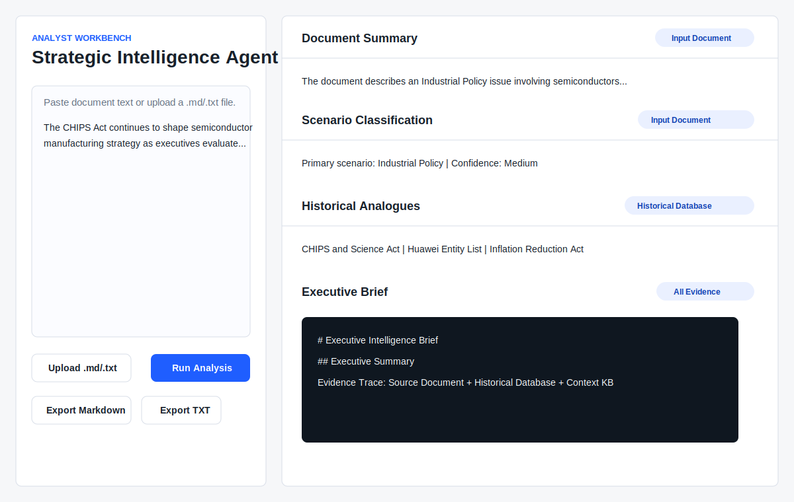

# Strategic Intelligence Agent

An analyst workbench that converts documents, articles, policy texts, and earnings excerpts into structured executive intelligence briefs.



## 90-Second Review

- **Purpose:** Turn unstructured strategic source material into executive intelligence briefs without requiring users to write prompts.
- **Demo:** Open [`dashboard/index.html`](dashboard/index.html) locally.
- **Sample briefs:** Review [`outputs/chips_act_brief.md`](outputs/chips_act_brief.md), [`outputs/banking_earnings_brief.md`](outputs/banking_earnings_brief.md), [`outputs/beginner_export_controls_zh_TW.md`](outputs/beginner_export_controls_zh_TW.md), and [`demo_outputs/red_sea_shipping_brief.md`](demo_outputs/red_sea_shipping_brief.md).
- **Architecture:** See [`docs/architecture_diagram.md`](docs/architecture_diagram.md), [`docs/system_architecture.md`](docs/system_architecture.md), and [`docs/agent_router_design.md`](docs/agent_router_design.md).
- **Non-AI user guide:** See [`docs/non_ai_user_guide.md`](docs/non_ai_user_guide.md), [`docs/non_ai_user_guide_zh_CN.md`](docs/non_ai_user_guide_zh_CN.md), and [`docs/non_ai_user_guide_zh_TW.md`](docs/non_ai_user_guide_zh_TW.md).
- **Evaluation:** See [`evaluation/evaluation_summary.md`](evaluation/evaluation_summary.md), [`evaluation/benchmark_results.csv`](evaluation/benchmark_results.csv), and [`docs/evaluation_framework.md`](docs/evaluation_framework.md).
- **Case study:** See [`docs/portfolio_case_study.md`](docs/portfolio_case_study.md).
- **Resume bullets:** See [`docs/resume_bullets.md`](docs/resume_bullets.md).

## Project Overview

Strategic Intelligence Agent is a portfolio-grade decision-support product for strategic intelligence and business analytics. It combines deterministic issue extraction, scenario classification, historical analogue retrieval, current context retrieval, implication analysis, evidence traceability, executive brief generation, and tool-selecting agent routing.

V2 added a local Analyst Workbench in `dashboard/`. V3 added an Agent Router and Tool Registry so the system can decide which tools to execute instead of always running a fixed sequence. V4 adds a multi-lens reasoning framework that surfaces competing interpretations, mechanisms, evidence support, and response patterns. V4.5 adds a bilingual non-AI user layer with guided questions and beginner, analyst, and executive output modes. V5 adds a benchmark evaluation framework for measuring scenario, mechanism, lens, and response retrieval coverage.
V6 turns the dashboard into a usable local app backed by FastAPI. The browser now calls the real Python pipeline, saves run artifacts, and supports Markdown, TXT, and JSON downloads.

## Quick Start

Install dependencies:

```bash
python3 -m pip install -r requirements.txt
```

Run the local server:

```bash
python3 -m uvicorn app:app --reload
```

Open the dashboard:

```text
http://127.0.0.1:8000/dashboard/
```

Analyze a document:

1. Choose a language.
2. Paste text or upload a `.md` / `.txt` file.
3. Choose a guided question.
4. Choose beginner, analyst, or executive output mode.
5. Click Analyze.
6. Download Markdown, TXT, or JSON results.

Runs are saved locally under `outputs/runs/`. See [docs/local_app_setup.md](docs/local_app_setup.md), [docs/run_management_design.md](docs/run_management_design.md), and [docs/json_artifact_design.md](docs/json_artifact_design.md).

## What This Is / Is Not

This is:

- A decision-support workflow.
- A strategic intelligence workbench.
- An analyst productivity product.
- A business analytics portfolio project.
- A demonstration of agent-style workflow orchestration.

This is not:

- A trading platform.
- A forecasting system.
- Investment advice.
- A source of trading recommendations, price targets, expected returns, or portfolio allocation guidance.

## Architecture

```text
Input Document
-> Agent Router
-> Tool Selection
-> Tool Execution
-> Result Synthesis
-> Multi-Lens Reasoning
-> Executive Intelligence Brief
-> Analyst Workbench Display / Export
```

See [docs/architecture_diagram.md](docs/architecture_diagram.md) and [docs/system_architecture.md](docs/system_architecture.md) for more detail.

## Workflow

1. The analyst pastes or uploads a document.
2. The user selects English, Simplified Chinese, or Traditional Chinese.
3. The user chooses a guided question and output mode.
4. The system extracts issue fields such as actors, industries, policy terms, and document type.
5. The Agent Router evaluates document type, scenario, industries, actors, and keywords.
6. The Tool Registry exposes available tools.
7. The router selects or skips tools and records why.
8. Selected tools execute and synthesize results.
9. The workbench displays collapsible sections with evidence labels and execution trace.
10. The executive brief can be exported as Markdown or TXT.

## Evolution of the System

```text
V0.1 Deterministic Workflow
  -> V0.5 Historical Retrieval
  -> V1.0 Context Layer
  -> V2.0 Analyst Workbench
  -> V3.0 Agent Router and Tool Selection
  -> V4.0 Intelligence Reasoning Framework
  -> V4.5 Bilingual Non-AI User Layer
  -> V5.0 Evaluation and Credibility Framework
  -> V6.0 Usable Local Application
```

- **V0.1:** deterministic document-to-brief skeleton.
- **V0.5:** historical analogue retrieval.
- **V1.0:** current context retrieval and evidence traceability.
- **V2.0:** local analyst workbench UI.
- **V3.0:** agent router, tool registry, selected/skipped tools, execution trace, and reasoning record.
- **V4.0:** mechanism detection, multi-lens analysis, evidence assessment, historical response patterns, and monitoring considerations.
- **V4.5:** language selector, guided question buttons, beginner/analyst/executive modes, and localized user guides.
- **V5.0:** benchmark dataset, evaluator, generated metrics, evaluation report, and dashboard evaluation section.
- **V6.0:** FastAPI backend, real pipeline integration, run history, structured JSON artifacts, and Markdown/TXT/JSON downloads.

## Designed for Non-AI Users

V4.5 makes the workbench usable without prompt engineering. Users do not need to know how to write an AI prompt. They choose a guided question, paste or upload text, select an output mode, and review structured evidence-backed sections.

- **Guided buttons:** Eight repeatable business questions are mapped to internal analysis goals in [`knowledge_base/guided_questions.csv`](knowledge_base/guided_questions.csv).
- **Bilingual interface:** English, Simplified Chinese, and Traditional Chinese labels live in [`locales/`](locales/).
- **Output modes:** Beginner, Analyst, and Executive modes are implemented in [`src/output_adapter.py`](src/output_adapter.py).
- **User guides:** [`docs/non_ai_user_guide.md`](docs/non_ai_user_guide.md), [`docs/non_ai_user_guide_zh_CN.md`](docs/non_ai_user_guide_zh_CN.md), and [`docs/non_ai_user_guide_zh_TW.md`](docs/non_ai_user_guide_zh_TW.md).
- **Beginner examples:** [`examples/non_ai_user_examples/`](examples/non_ai_user_examples/) with generated outputs in [`outputs/`](outputs/).

## Business Value

Analysts often lose time turning messy source material into executive-ready intelligence. This project demonstrates how an analytics product can make that process repeatable:

- Information extraction structures unstructured text.
- Retrieval adds historical and current context.
- Evidence traceability makes output reviewable.
- Workflow design turns a one-off analysis task into a repeatable product.
- Executive brief generation creates a usable decision-support artifact.

See [docs/business_analytics_relevance.md](docs/business_analytics_relevance.md).

## Evaluation

V5 adds a benchmark-driven credibility layer. The goal is measurement, not new analysis features. The benchmark evaluates the existing deterministic pipeline against compact synthetic / curated test cases covering export controls, industrial policy, supply chain disruption, banking stress, earnings announcements, trade policy, sanctions, technology competition, regulatory change, and deliberate challenge cases.

The scores measure internal deterministic benchmark performance. They test consistency, coverage, and regression behavior. They do not represent real-world accuracy.

Current generated metrics are written to [`evaluation/benchmark_results.csv`](evaluation/benchmark_results.csv) and summarized in [`evaluation/evaluation_summary.md`](evaluation/evaluation_summary.md):

- Scenario Accuracy
- Mechanism Accuracy
- Lens Coverage Rate
- Response Retrieval Coverage
- Overall Benchmark Score

The methodology is documented in [`docs/evaluation_framework.md`](docs/evaluation_framework.md), [`docs/benchmark_design.md`](docs/benchmark_design.md), and [`docs/evaluation_limitations.md`](docs/evaluation_limitations.md). The benchmark is intentionally modest: cases are compact synthetic test cases, mechanism scoring is expected-name coverage, and the metrics are evaluation aids rather than claims of factual, legal, financial, geopolitical, live-retrieval, or LLM reasoning accuracy.

### What the Evaluation Does Not Prove

- It does not prove factual correctness of all generated outputs.
- It does not prove legal, financial, or geopolitical accuracy.
- It does not replace human expert review.
- It does not evaluate live web retrieval.
- It does not evaluate LLM reasoning quality.

## What This Demonstrates

- LLM-ready agent architecture without depending on paid APIs.
- Tool-selecting agent orchestration.
- Multi-lens reasoning and evidence assessment.
- Information extraction from unstructured documents.
- Retrieval from historical and current-context knowledge bases.
- Evidence-aware synthesis and executive communication.
- A usable dashboard for analyst workflow review.
- Product thinking around scope, non-goals, validation, and portfolio presentation.

## Repository Structure

```text
dashboard/                     Local browser analyst workbench.
docs/                          Portfolio, architecture, product, and interview docs.
examples/                      Source examples and demo inputs.
locales/                       English, Simplified Chinese, and Traditional Chinese UI text.
knowledge_base/                Historical analogue records.
knowledge_base/current_context/ Local context KB files by domain.
evaluation/                    Benchmark cases, generated results, and evaluation summary.
outputs/                       Generated executive intelligence briefs.
demo_outputs/                  Generated portfolio demo briefs.
scripts/                       Validation scripts.
src/                           Deterministic analysis pipeline.
legacy/financial_rubric_agent/ Preserved earlier project history.
```

## Run The Workbench

Start the FastAPI server:

```bash
python3 -m uvicorn app:app --reload
```

Open the local app:

```text
http://127.0.0.1:8000/dashboard/
```

The dashboard supports language selection, guided question buttons, output mode selection, paste input, `.md` and `.txt` uploads, real backend analysis, run history, evidence labels, and Markdown/TXT/JSON download.

## Run The Pipeline

```bash
python3 src/run_agent.py examples/chips_act_example.md --output outputs/chips_act_brief.md
python3 src/run_agent.py examples/banking_earnings_example.md --output outputs/banking_earnings_brief.md
python3 src/run_agent.py examples/red_sea_shipping_example.md --output outputs/red_sea_shipping_brief.md
python3 src/run_agent.py examples/agent_export_controls.md --output outputs/agent_export_controls_brief.md
python3 src/run_agent.py examples/agent_earnings.md --output outputs/agent_earnings_brief.md
python3 src/run_agent.py examples/v4_export_controls_reasoning.md --output outputs/v4_export_controls_reasoning_brief.md
```

## Demo Outputs

V2 demo inputs live in `examples/demo_inputs/`. Validation generates matching briefs in `demo_outputs/`:

- `demo_outputs/semiconductor_policy_brief.md`
- `demo_outputs/bank_earnings_brief.md`
- `demo_outputs/supply_chain_disruption_brief.md`
- `demo_outputs/red_sea_shipping_brief.md`

## Validation

```bash
python3 -m compileall src
python3 scripts/validate_v05.py
python3 scripts/validate_v10.py
python3 scripts/validate_v20.py
python3 scripts/validate_v30.py
python3 scripts/validate_v41.py
python3 scripts/validate_v45.py
python3 scripts/validate_v50.py
python3 scripts/validate_v60.py
```

The V2 validator checks that the dashboard loads, outputs generate, exports are written to `outputs/`, and evidence traces exist.
The V3 validator checks routing, tool selection, execution trace, reasoning record, and routed outputs.
The V4.1 validator checks lens analysis, evidence assessment, mechanisms, response patterns, generated outputs, and non-advisory language.
The V4.5 validator checks localization files, guided questions, dashboard controls, non-AI user guides, generated beginner outputs, and forbidden advice language.
The V5.0 validator checks benchmark data, generated metrics, evaluation reporting, dashboard evaluation display, and evaluation docs.
The V6.0 validator checks FastAPI health, dashboard API wiring, run folder creation, JSON artifacts, downloads, and run history.

## Portfolio Value

This project demonstrates:

- AI product architecture without overclaiming model intelligence.
- Agent workflow decomposition.
- Agent router and tool registry design.
- Deterministic retrieval and synthesis.
- Business analytics product thinking.
- Evidence-aware executive communication.
- Frontend product packaging for a GitHub portfolio.

Supporting docs:

- [docs/product_walkthrough.md](docs/product_walkthrough.md)
- [docs/product_requirements.md](docs/product_requirements.md)
- [docs/interview_story.md](docs/interview_story.md)
- [docs/resume_bullets.md](docs/resume_bullets.md)
- [docs/portfolio_case_study.md](docs/portfolio_case_study.md)
- [docs/intelligence_reasoning_framework.md](docs/intelligence_reasoning_framework.md)
- [docs/multi_lens_analysis_design.md](docs/multi_lens_analysis_design.md)
- [docs/evidence_assessment_design.md](docs/evidence_assessment_design.md)
- [docs/v45_non_ai_user_layer.md](docs/v45_non_ai_user_layer.md)
- [docs/localization_design.md](docs/localization_design.md)
- [docs/guided_question_design.md](docs/guided_question_design.md)
- [docs/evaluation_framework.md](docs/evaluation_framework.md)
- [docs/benchmark_design.md](docs/benchmark_design.md)
- [docs/evaluation_limitations.md](docs/evaluation_limitations.md)
- [docs/local_app_setup.md](docs/local_app_setup.md)
- [docs/run_management_design.md](docs/run_management_design.md)
- [docs/json_artifact_design.md](docs/json_artifact_design.md)

## Future Roadmap

- Add optional LLM provider support behind the existing deterministic interfaces.
- Add richer source metadata with dates and URLs.
- Add structured JSON intermediate artifacts.
- Add tests for retrieval scoring edge cases.
- Add a lightweight local server for direct dashboard-to-`outputs/` saving.
- Add user-selectable knowledge-base filters and evidence review controls.
- Add richer localization coverage for every generated evidence line.
- Add longer benchmark documents and human review notes for evaluation cases.
- Add authentication or desktop packaging if the local app is ever moved beyond single-user local execution.

## Limitations

- V4.5 remains deterministic and keyword-based.
- The dashboard is a local static interface.
- Browser downloads are served by the local FastAPI app after each run.
- No live web retrieval is performed.
- Localization is template-based and does not use an external translation API.
- Benchmark metrics are based on compact deterministic cases and should not be treated as real-world accuracy claims.
- V6 is intended for local single-user execution, not hosted production deployment.
- No forecasts, probabilities, investment advice, or trading recommendations are generated.
