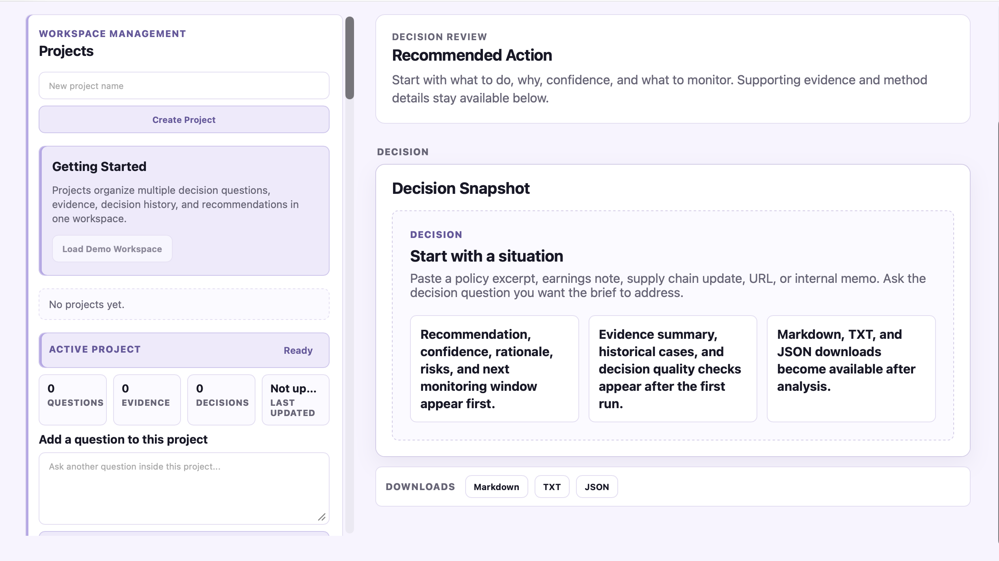

# Strategic Intelligence Decision Companion

Strategic Intelligence Decision Companion is a reviewer-first Enterprise Decision Intelligence Platform for structuring complex strategic decisions.

It helps product leaders, analysts, executives, and reviewers turn ambiguous source material and project evidence into deterministic, evidence-backed, auditable decision-support artifacts.



The Decision Workspace presents projects, decision questions, evidence, deterministic analysis, review state, and downloadable artifacts in one auditable flow.

This is not a chatbot, autonomous researcher, monitoring system, forecasting engine, investment advisor, legal advisor, or autonomous decision maker.

Strategic decisions rarely fail because no one can generate text. They fail because evidence is incomplete, trade-offs are unclear, assumptions are hidden, and teams do not know what should change their view.

Repo 5 is built around that problem.

Most AI systems optimize for generating answers. Strategic Intelligence Decision Companion optimizes for improving decision quality.

It separates evidence from inference, recommendations from facts, confidence from certainty, and reviewer judgment from system-generated structure. The goal is not to predict outcomes. The goal is to make strategic reasoning explicit enough for human review.

## The Problem

Modern AI systems are excellent at answering questions, summarizing documents, and generating fluent text. Those capabilities are useful, but they are not the same as decision support.

Strategic decisions require a different shape of reasoning. A reviewer needs to know:

- What decision is actually being made.
- Which evidence matters.
- Which assumptions remain unresolved.
- Which constraints affect the decision.
- Which risks are supported by evidence.
- Which evidence conflicts with or duplicates other evidence.
- Whether the decision is ready for review.
- Which possible pathways deserve comparison.
- What would require reassessment later.

Strategic Intelligence Decision Companion was built to support that workflow.

It turns ambiguous source material, accepted project evidence, and decision questions into reviewable decision briefs, evidence intelligence, readiness maps, pathway drafts, pathway comparison matrices, and reviewer-controlled review records.

## Before And After

| Traditional AI | Strategic Intelligence Decision Companion |
| --- | --- |
| Summarizes source material | Structures a decision-support workflow |
| Answers a question | Clarifies the decision being made |
| Generates text | Builds reviewable decision artifacts |
| Produces a response | Produces evidence-backed decision support |
| Treats uncertainty as prose | Exposes assumptions, unknowns, gaps, and change triggers |
| Hides reasoning inside a generated answer | Preserves traceable evidence, metadata, and review state |
| Ends at the answer | Supports timeline, delta, readiness, pathway comparison, and review |

## Product Workflow

The platform is organized as a local decision workspace:

```text
Project
  |
  v
Decision Questions
  |
  v
Evidence Library
  |
  v
Evidence Intelligence
  |
  v
Decision Readiness
  |
  v
Decision Pathway Drafts
  |
  v
Pathway Comparison Matrix
  |
  v
Reviewer Review
  |
  v
Decision Timeline and Delta
```

Evidence can be retrieved only through explicit reviewer action. Retrieved items enter a review queue first. Accepted evidence becomes part of the project Evidence Library. Analysis and decision-support views remain deterministic and do not bypass reviewer control.

The system helps reviewers compare defensible decision paths. It does not choose a best path, rank options, assign probabilities, or make final decisions.

## Example Decision-Support Output

A semiconductor manufacturer faces new export controls. Management needs to decide whether investment plans, customer exposure reviews, and supply-chain monitoring should change.

The platform structures the situation as:

```text
Decision Question:
Should we adjust investment and supply-chain plans in response to new export controls?

Evidence:
Accepted project evidence covering customer eligibility, licensing uncertainty,
supplier exposure, compliance burden, market access, and operational timing.

Evidence Intelligence:
Possible duplicate evidence, potential conflicts, freshness concerns,
source concentration risks, and reviewer attention items.

Decision Readiness:
Mapped evidence coverage, assumptions, unknowns, constraints, historical support,
and open reviewer questions.

Decision Pathway Drafts:
Possible staged response, further evidence required, regulatory clarity,
or contingency preparation pathways.

Pathway Comparison:
Side-by-side comparison of constraints, risks, supporting evidence,
unknowns, trade-offs, and decision triggers.

Reviewer Review:
Human-controlled notes, unresolved questions, and review statuses.
```

This output is a decision-support artifact. It is not investment advice, legal advice, trading advice, or a claim of future accuracy.

## Core Capabilities

| Capability | What It Provides | Where To Learn More |
| --- | --- | --- |
| Decision Workspace | Project-scoped questions, evidence, runs, timeline, delta, and review state. | [Product Overview](docs/ProductOverview.md) |
| Evidence Library | Local evidence store for manual notes and accepted retrieved evidence. | [Evidence Architecture](docs/EvidenceArchitecture.md) |
| Evidence Intelligence | Deterministic duplicate, conflict, novelty, freshness, coverage, and source-diversity support. | [Evidence Philosophy](docs/EvidencePhilosophy.md) |
| Decision Readiness | Evidence and framework coverage map with assumptions, unknowns, gaps, and reviewer questions. | [Decision Intelligence Framework](docs/DecisionIntelligenceFramework.md) |
| Decision Pathway Drafts | Reviewer-facing pathway scaffolds without ranking or recommendation. | [Documentation Index](docs/DocumentationIndex.md) |
| Pathway Comparison Matrix | Categorical side-by-side comparison of possible pathways. | [Documentation Index](docs/DocumentationIndex.md) |
| Reviewer Review Layer | Reviewer-controlled statuses, notes, unresolved questions, and audit-friendly review summary. | [Trust Model](docs/TrustModel.md) |
| Decision Brief | Deterministic analysis artifact with evidence, confidence, monitoring signals, and quality checks. | [Review Guide](docs/ReviewGuide.md) |
| Decision Quality Evaluation | Deterministic checks for product-quality properties of generated briefs. | [Evaluation Strategy](docs/EvaluationStrategy.md) |
| Historical Analogues | Historical comparison without treating past cases as predictions. | [Product Overview](docs/ProductOverview.md) |

## Reviewer-First Governance

The product is intentionally bounded.

It does not:

- Autonomously browse the web.
- Run background monitoring.
- Make final decisions.
- Select a best pathway.
- Rank pathways.
- Assign probabilities to outcomes.
- Provide investment advice.
- Provide legal advice.
- Replace reviewer judgment.

The reviewer remains responsible for accepting evidence, interpreting trade-offs, resolving open questions, and making any final decision.

## Architecture

The repository is a local FastAPI application with a deterministic analysis pipeline, local JSON storage, a vanilla Decision Workspace, and downloadable artifacts.

```text
Dashboard (vanilla HTML/CSS/JS)
  |
  v
FastAPI App
  |
  v
Project Workspace
  |
  v
Evidence + Readiness + Pathway + Review Modules
  |
  v
Deterministic Decision Engine
  |
  v
Markdown, TXT, JSON, Trace, Metadata
```

| Area | Role |
| --- | --- |
| `app.py` | FastAPI entrypoint and API routes. |
| `src/` | Decision engine, evidence, readiness, pathway, comparison, review, confidence, and evaluation modules. |
| `dashboard/` | Local browser implementation for the Decision Workspace. |
| `knowledge_base/` | Local mechanism, analogue, outcome, and playbook records. |
| `docs/` | Product, engineering, governance, evidence, evaluation, and research documentation. |
| `demo_case_outputs/` | Bundled generated artifacts for review. |
| `tests/` | Pytest coverage for API behavior, workspace behavior, and decision-quality foundations. |

Important modules:

- `src/project_workspace.py`: local JSON project storage, questions, evidence library, timeline, delta, and review state.
- `src/evidence_intelligence.py`: deterministic evidence-set review support.
- `src/decision_readiness.py`: evidence-to-framework readiness mapping.
- `src/decision_pathways.py`: deterministic pathway draft generation.
- `src/pathway_comparison.py`: categorical pathway comparison.
- `src/decision_review.py`: reviewer-controlled review layer.
- `dashboard/project.js`: Decision Workspace browser behavior.

The platform does not require a database, cloud service, background worker, external UI framework, LangGraph, RAG framework, autonomous agent, or scheduled retrieval.

## Repository Guide

Start here:

1. [Product Overview](docs/ProductOverview.md)
2. [Decision Intelligence Framework](docs/DecisionIntelligenceFramework.md)
3. [Evidence Architecture](docs/EvidenceArchitecture.md)
4. [Evidence Philosophy](docs/EvidencePhilosophy.md)
5. [Trust Model](docs/TrustModel.md)
6. [Review Guide](docs/ReviewGuide.md)
7. [Documentation Index](docs/DocumentationIndex.md)

For release and repository maturity context:

- [Repository Maturity Review](docs/RepositoryMaturityReview.md)
- [Testing](docs/Testing.md)
- [Folder Structure](docs/FolderStructure.md)
- [Changelog](CHANGELOG.md)

## Quick Start

Launch the local product:

```bash
./run_app.sh
```

Or use the cross-platform Python launcher:

```bash
python3 launch.py
```

Open:

```text
http://localhost
```

## Developer Startup

Developers can still run the FastAPI app directly:

```bash
python3 -m pip install -r requirements.txt
python3 -m uvicorn app:app --reload
```

Developer route:

```text
http://127.0.0.1:8000/workspace
```

Run validation:

```bash
.venv/bin/ruff check .
python3 -m py_compile app.py src/*.py
python3 -m pytest
```

## Reviewer Workflow

1. Create a project.
2. Add a decision question.
3. Add evidence manually or accept retrieved evidence into the Evidence Library.
4. Select evidence for analysis.
5. Run deterministic analysis.
6. Inspect Evidence Intelligence.
7. Review Decision Readiness.
8. Compare Decision Pathway Drafts.
9. Inspect the Pathway Comparison Matrix.
10. Record reviewer notes, unresolved questions, and review statuses.
11. Review Decision Timeline, Decision Delta, and downloadable Markdown/TXT/JSON artifacts.

## Demo Scenarios

Demo walkthroughs are documented in [docs/GettingStarted/DemoScenarios.md](docs/GettingStarted/DemoScenarios.md).

Representative scenarios include:

- Federal Reserve Rate Hike
- Export Controls
- Supply Chain Disruption
- Insurance Company Review
- Strategic Partnership

Generated workspace artifacts are available under `demo_case_outputs/`.

## Current Status

| Area | Status |
| --- | --- |
| Architecture | Stable local Decision Intelligence Platform. |
| Workspace | Project questions, evidence library, decision timeline, delta, and review state implemented. |
| Evidence | Evidence lifecycle, validation, ranking, intelligence, and review queue foundations implemented. |
| Readiness | Decision readiness mapping, framework evidence mapping, gaps, assumptions, and unknowns implemented. |
| Pathways | Deterministic pathway drafting and pathway comparison implemented. |
| Review | Reviewer-controlled review layer implemented without approval or selection workflow. |
| Evaluation | Deterministic Decision Quality Evaluation Harness implemented. |
| Decision Workspace | Local reviewer workspace implemented in vanilla HTML/CSS/JavaScript. |
| CI | Ruff, compile checks, and pytest used for validation. |
| Portfolio Readiness | Suitable for external review as a mature AI product architecture project. |

## Limitations

The repository intentionally avoids:

- Autonomous web agents
- Background retrieval
- Live monitoring
- Benchmark superiority claims
- Investment advice
- Legal advice
- Trading advice
- Statistical confidence claims
- Database infrastructure
- Login, auth, or account systems
- Cloud dependency
- External frontend frameworks

These boundaries keep the platform local, reviewable, deterministic, auditable, and maintainable.

## Roadmap

Near-term direction:

1. Preserve the reviewer-first decision workspace as the center of the product.
2. Continue tightening documentation around workspace, evidence, readiness, pathway comparison, and review.
3. Keep retrieval user-triggered and review-queue based.
4. Add future retrieval providers only behind the existing provider interface.
5. Avoid autonomous decision behavior, hidden ranking, or unreviewable reasoning loops.
