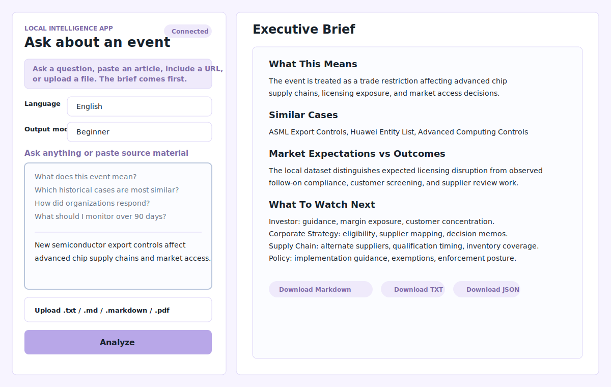

# Strategic Intelligence Agent

A local FastAPI decision-support workspace that turns strategic source material into structured executive briefs with decision criteria, historical analogues, strategic lessons, evidence notes, and downloadable artifacts.



## At A Glance

Strategic Intelligence Agent helps analysts, product leaders, strategy teams, and portfolio reviewers make sense of business, policy, supply-chain, market-access, and geopolitical situations. A user can paste source text, upload a supported file, or provide a readable URL, then generate a local decision brief that separates the current issue, decision criteria, options, historical evidence, trade-offs, monitoring signals, and limitations.

It is different from a generic summarizer because it does not only shorten the source. It structures the situation as a decision-support workflow and produces reviewable Markdown, TXT, JSON, trace, and metadata artifacts.

## Product Summary

Strategic Intelligence Agent is a local analyst workbench for reviewing business, policy, supply-chain, market-access, and geopolitical source material. It helps users move from unstructured input to a structured brief that explains the issue, the decision criteria, available paths, historical patterns, evidence limitations, and next monitoring steps. The app is designed for decision support and portfolio demonstration. It is not a live research platform, forecasting engine, trading advisor, legal advisor, or deployed SaaS product.

The product is built around a documented [Decision Intelligence Framework](docs/DecisionIntelligenceFramework.md) that separates situation understanding, decision definition, evidence assessment, historical knowledge, decision reasoning, monitoring, and learning. This framework is the conceptual foundation for future product strategy, evaluation, and roadmap decisions.

## Strategic Direction

Version 1.0 is portfolio-ready. Future development should focus on evidence quality, evaluation rigor, trust, and decision quality rather than feature volume. The project intentionally avoids feature bloat and is designed as a long-term Decision Intelligence Platform with clear boundaries, reviewable artifacts, and human-controlled judgment.

## Research Direction

Version 3 begins a research validation layer for future work. The current repository implements product QA and deterministic decision-quality evaluation; it does not claim scientific proof, benchmark superiority, or real-world accuracy. Research docs under [docs/research](docs/research/ResearchAgenda.md) define future directions for human review, benchmark strategy, failure-mode tracking, and decision-intelligence research.

## Who It Is For

- Analysts preparing executive briefings from messy source material.
- Product managers and strategy teams comparing current issues with historical cases.
- Business analytics stakeholders who need structured decision-support artifacts.
- Recruiters, admissions reviewers, and engineers evaluating an AI product architecture portfolio project.

## Problem It Solves

Strategic source material is often ambiguous. A policy announcement, earnings excerpt, supply-chain disruption, or regulatory update may contain useful signals, but a reviewer still needs to identify what happened, what decision matters, which criteria should drive the response, what historical cases resemble it, what evidence is weak, and what should be monitored next.

This project turns that workflow into a repeatable local application.

## What The App Supports Today

- Local FastAPI backend and browser dashboard.
- Plain-language question input.
- Pasted text analysis.
- Uploads for `.txt`, `.md`, `.markdown`, and text-based `.pdf` files.
- User-provided readable URL extraction when the page text can be fetched locally.
- Beginner, analyst, and executive output modes.
- English, Simplified Chinese, and Traditional Chinese output structure.
- Deterministic local modules for issue extraction, scenario classification, mechanism detection, historical analogue retrieval, outcome retrieval, strategic lesson generation, evidence assessment, and brief generation.
- V2 foundation fields for a Decision Case Schema, Evidence Ledger, and qualitative Confidence Assessment.
- Lightweight deterministic Decision Quality Evaluation Harness for generated analysis artifacts.
- Per-run storage under `outputs/runs/`.
- Markdown, TXT, and JSON downloads.
- Pytest, Ruff, compile checks, and GitHub Actions CI.

## What It Does Not Support

This project intentionally does not provide:

- Forecasts, probabilities, or guaranteed future outcomes.
- Investment advice, trading recommendations, or legal advice.
- Live web monitoring or autonomous internet research.
- RAG infrastructure or external vector search.
- Cloud deployment, authentication, or multi-user operations.
- OCR for scanned PDFs.
- Real-world accuracy guarantees.

URL mode only attempts to fetch readable text from a user-provided page. If the page blocks access or contains too little readable text, the app asks for pasted text or a file instead.

## Architecture Summary

The implementation is a local FastAPI app with a thin HTTP entrypoint and a separated service/pipeline workflow.

```text
User Input
  |
  v
FastAPI app.py
  |
  v
Analysis Service
  |
  v
Analysis Pipeline
  |
  v
Intelligence Modules
  |
  v
Brief + JSON Artifact
  |
  v
Run Storage + Downloads
```

Key implementation docs:

- [Documentation Index](docs/DocumentationIndex.md)
- [Engineering Architecture](docs/EngineeringArchitecture.md)
- [Analysis Pipeline](docs/Pipeline.md)
- [Folder Structure](docs/FolderStructure.md)
- [Testing](docs/Testing.md)
- [V2 Case Studies](docs/case_studies/semiconductor_export_controls.md): reviewer examples for evidence, confidence, and deterministic decision-quality evaluation.

## Local Setup

Install dependencies:

```bash
python3 -m pip install -r requirements.txt
```

Start the local server:

```bash
python3 -m uvicorn app:app --reload
```

Open the dashboard:

```text
http://127.0.0.1:8000/dashboard/
```

Each analysis creates a run folder under `outputs/runs/` with:

- `input.txt`
- `analysis.json`
- `brief.md`
- `brief.txt`
- `agent_trace.json`
- `metadata.json`

## Test And Quality Commands

Run the same checks used by CI:

```bash
python3 -m ruff check .
python3 -m compileall app.py src tests
python3 -m pytest
```

GitHub Actions runs dependency installation, compile validation, Ruff, and pytest on push and pull request.

## Demo Walkthrough

**Decision question**

```text
What should management consider after new semiconductor export controls affect customer eligibility and advanced chip supply chains?
```

**Supporting material**

```text
New semiconductor export controls affect advanced chip supply chains and market access. Equipment suppliers are reviewing licensing requirements, customer eligibility, and compliance documentation. Executives want to understand similar historical cases, observed outcomes, and what to monitor next.
```

**Expected output**

The local app produces a decision brief with:

- Decision Snapshot
- Decision Criteria
- Decision Paths and Preferred Path
- Trade-offs and assumptions
- Historical evidence and analogues
- Monitoring considerations
- Evidence and limitation notes

**Downloadable artifacts**

Each run writes local artifacts under `outputs/runs/<run_id>/`:

- `brief.md`
- `brief.txt`
- `analysis.json`
- `agent_trace.json`
- `metadata.json`
- `input.txt`

V2 foundation outputs also add `decision_case`, `evidence_ledger`, `confidence_assessment`, and `decision_quality_evaluation` fields to `analysis.json` and an **Evidence and Confidence** section to the generated brief.

Start with [docs/ReviewGuide.md](docs/ReviewGuide.md) for a reviewer-friendly path through the repo.

## Example Analysis

Sample input:

```text
The government announced new export controls affecting advanced semiconductor manufacturing equipment and high-performance AI chips. Several chipmakers and equipment suppliers said they are reviewing licensing requirements and customer exposure. The measures may limit access to advanced-node production tools for firms tied to restricted end users. Executives are preparing internal briefings on supply chain exposure, compliance burden, and market access implications.
```

The system identifies:

| Field | Example output |
| --- | --- |
| Event type | Export control policy update |
| Key actors | Regulators, semiconductor manufacturers, equipment suppliers, restricted end users |
| Affected sector | Semiconductors and advanced chip supply chains |
| Scenario category | Export Controls |
| Mechanisms | Technology Containment, Market Access Restriction, Compliance Burden, Supply Chain Reconfiguration |
| Historical analogues | Prior semiconductor equipment controls, entity-list restrictions, industrial policy responses |
| Historical outcomes | Licensing reviews, exposure mapping, customer segmentation, compliance process expansion |
| Strategic lessons | Export-control shocks often require exposure mapping, screening, customer review, and management reporting routines |
| Evidence note | Based on local curated records and deterministic retrieval; human review remains required |

## Sample Output Preview

The following is an illustrative preview of the local deterministic workflow. It is not a forecast, investment recommendation, legal opinion, or claim of future accuracy.

```text
Decision Snapshot:
Current Recommendation: Map exposure and prepare staged response options.
Confidence: Medium.
Rationale: The highest-priority criteria are customer exposure, licensing
uncertainty, margin impact, and compliance burden.
Next Review Window: Reassess as implementation rules, license outcomes, and
management guidance become clearer.

Decision Criteria:
- Customer exposure
- Licensing uncertainty
- Margin impact
- Compliance burden
- Supply chain resilience

Decision Paths:
Option A: Wait for final rule detail.
Option B: Map exposure and prepare staged adjustments. Recommended.
Option C: Immediately reduce exposed customers, suppliers, or product lines.

Preferred Path:
Option B ranks first because it performs best on the criteria that matter most
for this decision while preserving flexibility.

Historical Evidence:
Case: Prior semiconductor equipment controls.
Why it supports the recommendation: licensing and equipment access became
operational work, not only policy headlines.
Key limitation: current rule scope, actor exposure, and timing may differ.

Monitoring:
Track rule implementation, license denials, customer eligibility, margin
pressure, supplier exposure, and management commentary.
```

## Why This Is Not Just A Summarizer

A generic summarizer tells the user what the document says. Strategic Intelligence Agent helps the user reason about what kind of strategic issue the document represents and what evidence should shape the response.

| Generic Summarizer | Strategic Intelligence Agent |
| --- | --- |
| Condenses source text | Extracts the issue, actors, sector, and scenario |
| Produces a shorter document | Structures a decision-support brief |
| Usually stays inside the source | Connects the issue to local historical analogues |
| May miss operating mechanisms | Detects mechanisms such as compliance burden, market access restriction, or supply chain reconfiguration |
| Does not explain historical patterns | Retrieves simplified observed outcomes and strategic lessons |
| Rarely separates action from monitoring | Produces decision paths, actions, monitoring points, evidence notes, and limitations |
| Outputs prose only | Writes Markdown, TXT, JSON, trace, and metadata artifacts |

## What Users Can Do With The Output

- Prepare an executive briefing.
- Compare a current issue with historical analogues.
- Identify strategic mechanisms behind a policy, market, or operational event.
- Structure risk and strategy discussions.
- Generate decision-support notes for analyst review.
- Export JSON artifacts for further analysis.
- Preserve run history for portfolio demonstration or review.

The output is designed to support thinking and communication. It does not replace expert judgment.

## Product Documentation

- [Documentation Index](docs/DocumentationIndex.md)
- [Product Overview](docs/ProductOverview.md)
- [Decision Intelligence Framework](docs/DecisionIntelligenceFramework.md)
- [Evidence Architecture](docs/EvidenceArchitecture.md)
- [Product Strategy](docs/ProductStrategy.md)
- [Demo Scenarios](docs/DemoScenarios.md)
- [Portfolio Narrative](docs/PortfolioNarrative.md)
- [Repository Trust Audit](docs/RepositoryTrustAudit.md)
- [Trust Model](docs/TrustModel.md)
- [Evidence Philosophy](docs/EvidencePhilosophy.md)
- [Evaluation Strategy](docs/EvaluationStrategy.md)
- [Evaluation Methodology](docs/EvaluationMethodology.md)
- [Golden Output Philosophy](docs/GoldenOutputPhilosophy.md)
- [Research Agenda](docs/research/ResearchAgenda.md)
- [Local App Setup](docs/local_app_setup.md)
- [Run Management Design](docs/run_management_design.md)
- [JSON Artifact Design](docs/json_artifact_design.md)
- [Evaluation Framework](docs/evaluation_framework.md)
- [Evaluation Limitations](docs/evaluation_limitations.md)

## Maintainer Documentation

- [Contributing](CONTRIBUTING.md)
- [Security](SECURITY.md)
- [Public Release Checklist](docs/PublicReleaseChecklist.md)
- [Release Guide](docs/ReleaseGuide.md)
- [Future Engineering Recommendations](docs/FutureEngineeringRecommendations.md)
- [License Guidance](docs/LicenseGuidance.md)

## Repository Structure

```text
app.py                         Local FastAPI backend.
dashboard/                     Static browser dashboard served by FastAPI.
docs/                          Architecture, product, portfolio, and usage docs.
examples/                      Source examples and demo inputs.
knowledge_base/                Local context, mechanism, analogue, outcome, and playbook records.
outputs/                       Generated artifacts; runtime run folders are gitignored.
scripts/                       Validation scripts.
src/                           Analysis service, pipeline, helpers, and intelligence modules.
tests/                         Pytest suite for helpers and API smoke tests.
evaluation/                    Benchmark cases, results, and evaluation summary.
legacy/financial_rubric_agent/ Preserved earlier project history.
```

## Portfolio Positioning

This repository demonstrates practical AI product engineering rather than a single prompt demo. It shows:

- FastAPI backend design with a thin app entrypoint.
- Service and pipeline separation.
- Deterministic decision-intelligence workflow orchestration.
- Historical analogue and outcome reasoning.
- Evidence traceability and limitation reporting.
- Additive V2 decision-quality structures: Decision Case, Evidence Ledger, Confidence Assessment, and Decision Quality Evaluation.
- Local run artifact generation.
- Dashboard UX for non-technical users.
- Localization and output-mode awareness.
- Testing, linting, compile checks, and CI maturity.

The project is strongest as a portfolio artifact for AI product architecture, analytics product thinking, and strategic intelligence workflow design.

## Current Status

The repository is a local usable application with a deterministic document-to-brief pipeline, dashboard, run history, downloadable artifacts, test coverage, linting, and CI. It is ready for external review as a portfolio project, with remaining limitations clearly documented.
