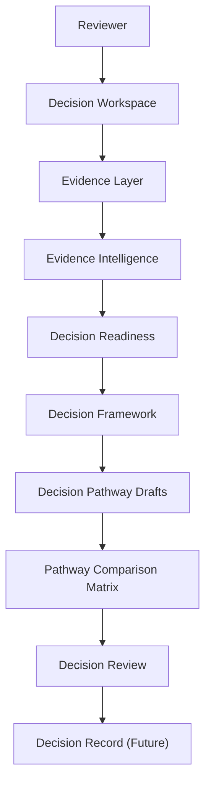
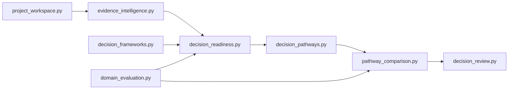
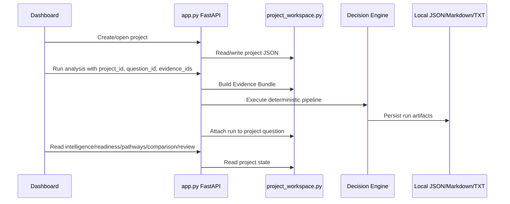

# Enterprise Architecture

Repo 5 is a local-first, deterministic Decision Intelligence product. It uses FastAPI, vanilla dashboard assets, Python modules, local JSON project files, and generated Markdown/TXT/JSON artifacts.

## Product Flow

## Module Dependency Direction

The desired direction is evidence to readiness to pathways to comparison to review. Shared utility modules may be imported across layers only when they have no product-layer dependency.

## Runtime Interaction

## Product Boundaries

- No autonomous background research.
- No scheduled monitoring.
- No LLM orchestration.
- No database or cloud service.
- Retrieval creates reviewable evidence candidates only.
- Decision Review records reviewer interpretation; it does not approve, reject, select, or recommend.
