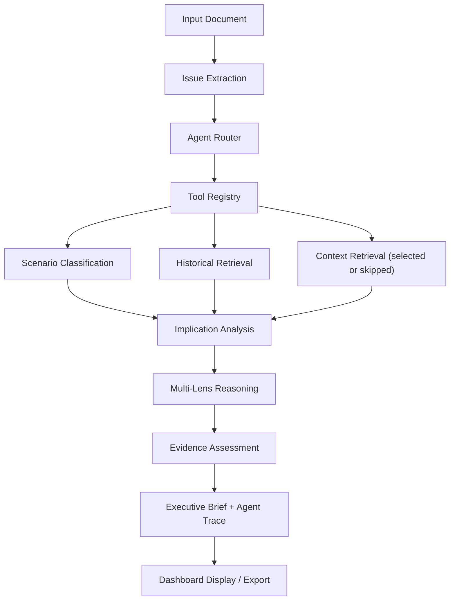

# Architecture Diagram

```mermaid
flowchart TD
    A["Input Document"] --> B["Issue Extraction"]
    B --> R["Agent Router"]
    R --> T["Tool Registry"]
    T --> C["Scenario Classification"]
    T --> D["Historical Retrieval"]
    T --> E["Context Retrieval (selected or skipped)"]
    C --> F["Implication Analysis"]
    D --> F
    E --> F
    F --> I["Multi-Lens Reasoning"]
    I --> J["Evidence Assessment"]
    J --> G["Executive Brief + Agent Trace"]
    G --> H["Dashboard Display / Export"]
```
