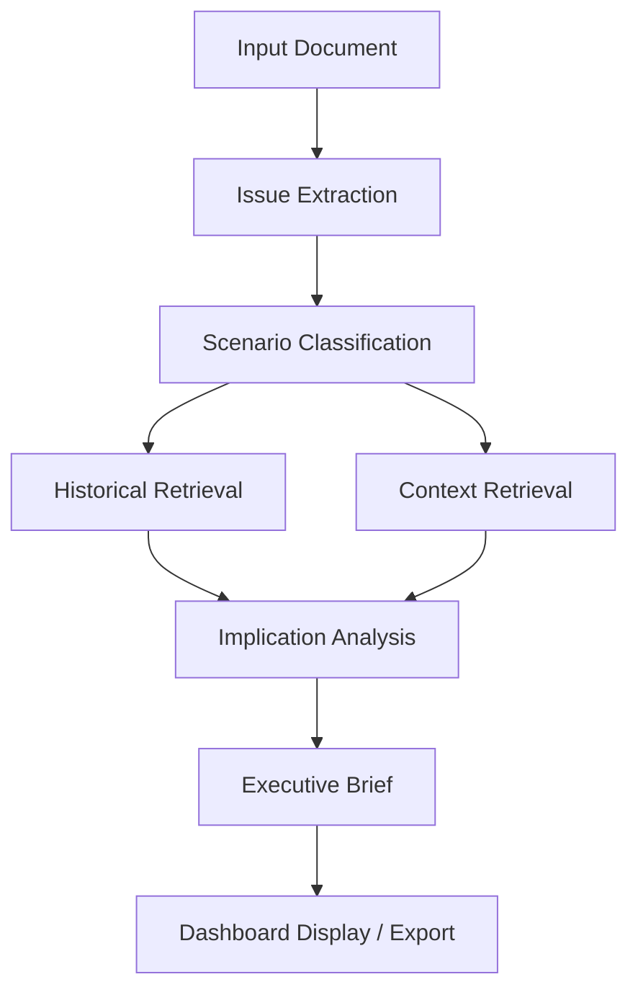

# Architecture Diagram

```mermaid
flowchart TD
    A["Input Document"] --> B["Issue Extraction"]
    B --> C["Scenario Classification"]
    C --> D["Historical Retrieval"]
    C --> E["Context Retrieval"]
    D --> F["Implication Analysis"]
    E --> F
    F --> G["Executive Brief"]
    G --> H["Dashboard Display / Export"]
```

